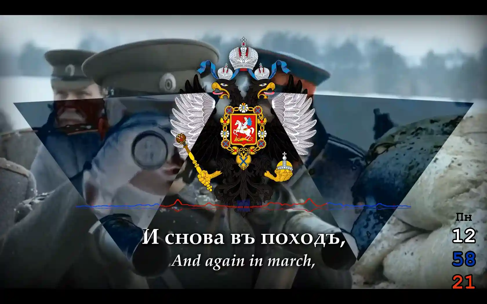

# mpv-scripts
## Contents
- [Contents](#contents)
- [Intro](#intro)
- [Installation](#installation)
- [Standalone mpv](#standalone-mpv-mpvconf)
- [App Versions](#app-versions)
- [Screenshots](#screenshots)
- [Script-Commands](#script-commands)
- [Terminal Commands](#terminal-commands)
- [Docs](doc)
- [Latest Updates](#latest-updates)

## Intro
Video clocks, multi-stereo audio-speed randomization ([aspeed](aspeed.lua)), animated mask generator ([automask](automask.lua)), animated spectrum ([autocomplex](autocomplex.lua)) & insta-cropping ([autocrop](autocrop.lua)) for [SMPlayer](https://smplayer.info) & [mpv](https://mpv.io)! Newest scripts in `mpv-scripts.zip` on GitHub. Toggle them by double-clicking on mute (m&m). Pictures, videos & audio can be drag & dropped onto SMPlayer, to light them up. The scripts can be opened & options edited in Notepad. Disable word-wrap for these scripts! [main](main.lua) has much more info, & options for which scripts & subtitles load, & ytdl. I use [Notepad++](https://notepad-plus-plus.org/downloads/) on Windows, & [Brackets](https://BRACKETS.IO) on MacOS.  All free for Windows, Linux, MacOS & Android. But Android has no extra-device randomization & no YouTube.

To use on YouTube select Open→URL in SMPlayer. Rumble, Odyssey, RedTube & rutube.ru also compatible. Double-clicking mute makes the mask smoothly vanish or re-appear, along with black-bars (smooth padding), & the audio switches btwn randomized & normal. aspeed.lua options can activate chipmunk mode on left-channel (in sync), as well as tri-color clocks! autocrop handles transparent input, too, along with a track-list with start & end times. mpv has instant zoom, but no scroll bar (to pan around with mouse, etc). Keyboard shortcuts only work if mpv has its own window (SMPlayer preference).  main has a subtitle override after playback-restart.

## Installation
In Windows extract all `.lua` scripts from the `.zip` & copy/paste them into `smplayer-portable` (or smplayer) folder. Then in SMPlayer Advanced Preferences enter 

`--script=.`

`.` is the directory containing `main.lua`. Then hit OK & play. Overall I consider playback smoother than VLC. [main](main.lua) is also a README, but in lua, & has more details. For YouTube also extract [yt-dlp](https://github.com/yt-dlp/yt-dlp/releases) into the same folder. Don't forget to update yt-dlp!  To remove the mpv/SMPlayer TitleBar use AutoHotkey (my ahk scripts are [here](https://github.com/TinosNitso/AutoHotkey)).

If not portable, or in Linux & MacOS, create folder `mpv-scripts` on Desktop. Then extract all scripts into it.  Then in SMPlayer enter

`--script=~/Desktop/mpv-scripts/`

`~/` means home folder. In Linux try `sudo apt install smplayer` or double-click the `.AppImage`. All scripts also compatible with `.snap` & `.flatpak` releases. 

On Android, go to mpv→SETTINGS→Advanced→Edit mpv.conf, then enter

`script=/sdcard/Android/media/is.xyz.mpv/`

Then copy scripts in to that exact folder, in internal main storage. However leave out autocomplex.lua (lags on smartphone).  `sdcard` is internal, unlike `SD card`.  Then use mpv file-picker to open an MP4 to give mpv media read-permission. In Android-11 media-apps can't normally run scripts from outside a media folder.  aspeed.lua struggles primarily because Android apps are singletons who can't spawn subprocesses.  I use [cx-file-explorer](https://cxfileexplorerapk.net) as explorer, 920 for text-editing, & chromium for browsing. [SNAPDROP.NET](https://SNAPDROP.NET) for lua transfer to smartphone.  

## Standalone mpv (`mpv.conf`)
It's also possible to double-click on `mpv.exe` or `mpv.app` & then drag & drop files & URLs directly on mpv, with all scripts fully active! This requires editing `mpv.conf`, like with Android. In Linux edit `~/.config/mpv/mpv.conf` & then right-click on an MP4 & open-with-mpv. In MacOS go mpv→Preferences... & use only 1 line:

`script=~/Desktop/mpv-scripts/`

In Windows + SMPlayer: Create New Text Document `smplayer-portable\mpv\mpv\mpv.conf` with Notepad, containing only the 1 line `script=../`. Then double-click `smplayer-portable\mpv\mpv.exe` & drag/drop files/URLs. Simpler than terminal commands!

## App Versions

mpv versions 0.38.0, 0.37.0, 0.36.0, 0.35.1 & 0.34.0 supported. v0.37+ preferred. mpv.exe can be [replaced](https://sourceforge.net/projects/mpv-player-windows/files/release/), within smplayer-portable. New MacOS builds are [here](https://laboratory.stolendata.net/~djinn/mpv_osx/), & Android is [here](https://github.com/mpv-android/mpv-android/releases).

SMPlayer-24.5.0 supported.  Releases tested include .7z .exe .app .AppImage .flatpak & .snap.

FFmpeg versions 6.1 (.deb), 6.0 (.exe .flatpak), 5.1.3, 5.1.2 (.app), 4.4.2 (.snap) & 4.3.2 (.AppImage) supported.

Lua versions 5.1 & 5.2 supported.

## Screenshots

https://github.com/user-attachments/assets/98cec5c2-43ac-422d-85b7-932719acf47c

Also on [YouTube](https://YOUTU.BE/le2JGgjRJBw).  The exact audio is copyrighted elsewhere (original [here](https://youtu.be/gWtGerBuNRA)).  Many geometries are possible, like my old fav:

## Script-Commands
Give mpv its own window then press ` & then enter any of these commands (but with proper inputs when needed). The bottom of every script has exact examples, like how to replace black pads with white pads.

- `script-binding toggle_crop   `
- `script-binding toggle_aspect `
- `script-binding toggle_complex`
- `script-binding aspeed        `
- `script-binding automask      `
- `script-message toggle        `
- `script-message toggle_aspect `
- `script-message exit          `
- `script-message quit          `
- `script-message title_remove  `
- `script-message resync        `
- `script-message loadstring           <string>      `
- `script-message print                <string>      `
- `script-message apply_framerate      <framerate>   `
- `script-message apply_limit          <detect_limit>`
- `script-message apply_crop           <meta>        `
- `script-message show                 <string>      <duration>             `
- `script-message set                  <script_opt>  <val>                  `
- `script-message title                <data>        <title_duration>       `
- `script-message detect_crop          <keep_center> <apply_inner_rectangle>`
- `script-message apply_pad            <pad_options> <pixelformat>     <pad_scale_flags> <par>        `
- `script-message apply_aspect         <aspect>      <toggle_duration> <toggle_t_delay>  <toggle_expr>`
- `script-message-to automask apply_eq <brightness>  <toggle_duration> <toggle_t_delay>  <toggle_expr>`

## Terminal Commands
To run in Windows from Command Prompt, create a New Text Document in SMPlayer folder & rename it `TEST.CMD`. Also copy in `TEST.MP4`. Then right-click on `TEST.CMD` & click `Edit`. In Notepad copy/paste:

`MPV\MPV --no-config --script=. TEST.MP4`

Then Save it & double-click it. The command line shows warnings, etc. mpv pauses when text in CMD is selected. Most ppl prefer an interface like SMPlayer.

In MacOS go to *Launchpad*→*Other*→*Terminal*. Then the exact `zsh` command is:

- `/Applications/SMPlayer.app/Contents/MacOS/mpv --script=~/Desktop/mpv-scripts/ "https://youtu.be/5qm8PH4xAss"`

That uses the mpv bundled with SMPlayer. In Linux the exact command to load YouTube from terminal is:

- `mpv --no-config --script=~/Desktop/mpv-scripts/ "https://youtu.be/5qm8PH4xAss"`

MacOS users can also drag & drop `mpv.app` onto Applications. Then the zsh command is:

- `/Applications/mpv.app/Contents/MacOS/mpv --no-config --script=~/Desktop/mpv-scripts/ "https://youtu.be/5qm8PH4xAss"` 

## Latest Updates
- Added script-message & function `show` to all scripts.
- Added script-message & function `set`  to all scripts.
- Added script-message & function `exit` to all scripts.
- Added           `script-message print` to all scripts.
- Added functions `callstring`, `pprint` & `pexpand_to_string` to all scripts. More rigorous codes. More elegant options.
- Added `function is_filter_present` to aspeed, autocrop & automask.
- Added nil script-bindings for all toggles.
- autocrop: Added `o.auto_aspect`, `o.auto_delay_aspect`, `o.start_aspect_on`, `o.gsubs_passes`, `o.gsubs` & `o.framerate`. Crop & aspect toggles now separated. Randomizes aspect @1Hz. The gsubs are for auto_aspect.  Bugfix for negative detections (w<0).  Removed `o.apply_min_ratio`.  Added script-message & function `apply_framerate` which interpolates to 50fps.  Improved `meta_osd`.  Removed `timers.apply_scale`.  9 examples include RANDOM_POWER; RANDOM_WALKER; CYCLE_min_max; CYCLE_HDTV_TV; RANDOM_N_FULLSCREEN; UP_AND_ACROSS; ACROSS_AND_DOWN; UP_LEFT_RIGHT_DOWN; & LINEAR_DISTRIBUTION.  
- automask: `o.res_safety` lowered by 1.  Added `eq=enable=0:...` & `convolution=enable=0:...` to `o.filterchain` (mask can increase contrast).  Removed `timers.apply_eq`.
- autocomplex: Added `o.freqs_samplerate` & "GREEN_BLUE;" example. Setting 4200 Hz makes each baton worth 200Hz.
- aspeed: Added `o.suppress_script_opts`. Added "RANDOM_SPEED;" `o.speed` example.
- `rotate` & `zoompan` now opt-in (autocomplex & automask). These null-ops can reduce performance.

The releases now display correct screenshots.  Also, webp & mp4/YT screenshots have been added.

Future version will set `o.framerate=nil`. Interpolation is just a bad thing!  Also, `o.auto_aspect` needs to be centered on `${video-params/aspect}`, so that the median aspect is true. Tall videos are fattened too much with the current formula.

